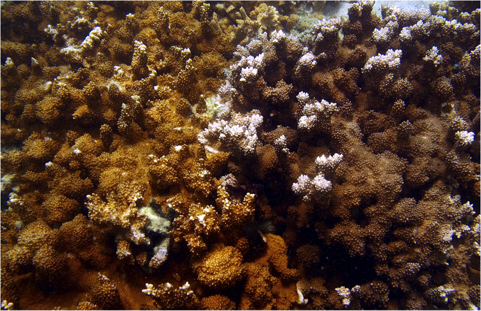

--------------------------------------------------------------------------------------
# Project Summary
This project aimed to look at the spatial variability of color morph and *Symbiodinium* clades C and D present in the Kane'ohe Bay, O'ahu, Hawai'i population of Montipora capitata. We investigated the distributions at scales ranging from location within the bay to location on an individual reef. We also looked at differences among reef types (fringing vs. patch) and depths. Heterogeneous mixtures of symbiont clades were considered in the analysis for spatial patterns. By investigating spatial variability of *Symbiodinium*, we furthered the understanding of potential stress-response in Kane'ohe Bay.

# Setup

## Load Packages
```{r Library Packages Needed, warning=FALSE, message=FALSE}
knitr::opts_knit$set(root.dir = normalizePath(".."))
library(data.table)
library(effects)
library(lsmeans)
library(devtools)
library(plyr)
library(reshape2)
library(RgoogleMaps)
library(plotrix)
library(zoo)
library(rgdal)
library(car)
library(scales)
library(png)
library(ecodist)
library(nnet)
```


## Import Data
```{r}
# Import Sample Metadata
Coral_Data <- read.csv("Data/Collection Data/Coral_Collection.csv")
Coral_Data$Depth..m. <- as.numeric(as.character(Coral_Data$Depth..m.))

# Import qPCR Data
source_url("https://raw.githubusercontent.com/jrcunning/steponeR/master/steponeR.R")
Mcap.plates <- list.files(path = "Data/qPCR_data", pattern = "txt$", full.names = T)
Mcap <- steponeR(files = Mcap.plates, delim="\t",
                 target.ratios=c("C.D"), 
                 fluor.norm = list(C=2.26827, D=0), 
                 copy.number=list(C=33, D=3))
Mcap <- Mcap$result

## Remove positive and negative controls from qPCR data
Mcap <- Mcap[grep("+", Mcap$Sample.Name, fixed=T, invert = T), ]
Mcap <- Mcap[grep("NTC", Mcap$Sample.Name, fixed = T, invert = T), ]
Mcap <- Mcap[grep("PCT", Mcap$Sample.Name, fixed = T, invert = T), ]

## Change "Sample.Name" column to "Colony"
colnames(Mcap)[which(colnames(Mcap)=="Sample.Name")] <- "Colony"

## Filter out detections without two technical replicates
Mcap$fail <- ifelse(Mcap$C.reps < 2 & Mcap$D.reps < 2, TRUE, FALSE)
fails <- Mcap[Mcap$fail==TRUE, ]
Mcap <- Mcap[which(Mcap$fail==FALSE),]

## Set C:D ratio to -Inf (when only D) and Inf (when only C)
Mcap$C.D[which(Mcap$C.reps<2)] <- -Inf
Mcap$C.D[which(Mcap$D.reps<2)] <- Inf

## Order qPCR data by Colony
Mcap <- Mcap[with(Mcap, order(Colony)), ]

## Calculate Proportion C and Proportion D
Mcap$propC <- Mcap$C.D / (Mcap$C.D+1)
Mcap$propD <- 1-Mcap$propC
Mcap$propD[which(Mcap$C.D==-Inf)] <-1
Mcap$propC[which(Mcap$C.D==-Inf)] <-0
Mcap$propD[which(Mcap$C.D==Inf)] <-0
Mcap$propC[which(Mcap$C.D==Inf)] <-1

## Categorize each sample as C-dominated or D-dominated
Mcap$Dom <- ifelse(Mcap$propC>Mcap$propD, "C", "D")

## Define category for symbiont mixture
Mcap$Mix <- factor(ifelse(Mcap$propC>Mcap$propD, 
                          ifelse(Mcap$propD!=0, "CD", "C"), 
                          ifelse(Mcap$propD>Mcap$propC, 
                                 ifelse(Mcap$propC!=0, "DC", "D"), NA)), 
                   levels = c("C", "CD", "DC", "D"))

# Merge Sample Metadata with qPCR Data
Symcap <- merge(Coral_Data, Mcap, by="Colony", all=T)
Symcap <- Symcap[with(Symcap, order(Colony)), ]


# Import Color Data
colscores <- read.csv("Data/Collection Data/Color_Scores.csv")

## Determine color scores by majority rule, and number of agreements
colscores$majority <- apply(colscores[,-1], 1, function(x) names(table(x))[which.max(table(x))])
colscores$n.agree <- apply(colscores[,-c(1,7)], 1, function(x) max(table(x)))

## Set which set of color scores will be used in analysis (=majority)
Symcap <- merge(Symcap, colscores[,c("Colony","majority","n.agree")], all=T)
Symcap$Color.Morph <- factor(Symcap$majority)

## Set color/symbiont groupings
Symcap$ColDom <- interaction(Symcap$Color.Morph, Symcap$Dom)

```

## Filter / transform data
#### Adjust Depth by Mean Sea Level
To account for the influence of tides, depth was adjusted according to the differences in mean sea level from the recorded sea level on each collection day to the nearest 6-minute interval. Mean sea level was obtained from NOAA daily tide tables for Moku o Lo'e.
```{r Adjust Depth, warning=FALSE, message=FALSE, results='hide'}
JuneTide=read.csv("Tide Tables/Station_1612480_tide_ht_20160601-20160630.csv")
JulyTide=read.csv("Tide Tables/Station_1612480_tide_ht_20160701-20160731.csv")
AugustTide=read.csv("Tide Tables/Station_1612480_tide_ht_20160801-20160812.csv")
Tide<-rbind(JuneTide, JulyTide, AugustTide)
Tide$Time <- as.POSIXct(Tide$TimeUTC, format="%Y-%m-%d %H:%M:%S", tz="UTC")
attributes(Tide$Time)$tzone <- "Pacific/Honolulu"
Symcap$Time2 <- as.POSIXct(paste(as.character(Symcap$Date), as.character(Symcap$Time)),
                                format="%m/%d/%y %H:%M", tz="Pacific/Honolulu")
Symcap$Time=Symcap$Time2

# Add estimated times for missing values
Symcap$Time[170] <- as.POSIXct("2016-06-14 12:07:00")
Symcap$Time[177] <- as.POSIXct("2016-06-14 12:20:00")
Symcap$Time[178] <- as.POSIXct("2016-06-14 12:22:00")
Symcap$Time[180] <- as.POSIXct("2016-06-14 13:08:00")
Symcap$Time[187] <- as.POSIXct("2016-06-14 12:42:00")
Symcap$Time[188] <- as.POSIXct("2016-06-14 12:44:00")
Symcap$Time[206] <- as.POSIXct("2016-06-16 13:10:00")
Symcap$Time[208] <- as.POSIXct("2016-06-16 13:24:00")
Symcap$Time[211] <- as.POSIXct("2016-06-16 12:37:00")
Symcap$Time[218] <- as.POSIXct("2016-06-16 12:27:00")
Symcap$Time[448] <- as.POSIXct("2016-07-16 13:32:00")

Round6 <- function (times)  {
  x <- as.POSIXlt(times)
  mins <- x$min
  mult <- mins %/% 6
  remain <- mins %% 6
  if(remain > 3L) {
    mult <- mult + 1
  } else {
    x$min <- 6 * mult
  }
  x <- as.POSIXct(x)
  x
}

Symcap$Time.r <- Round6(Symcap$Time)
Tide$Time.r <- Tide$Time
Symcap<-merge(Symcap, Tide, by="Time.r", all.x=T)
Symcap$newDepth <- Symcap$Depth..m.- Symcap$TideHT
Symcap$DepthInt <- cut(Symcap$newDepth, breaks = 0:13)
```

#### Filter out low confidence color assignments
```{r}
Symcap.f <- Symcap[which(Symcap$n.agree > 3), ]
```

## Figure 1: Coral Collection Map
Collection sites represented on this map indicate the 9 fringe and 16 patch reef sites for a total of 25 collection reefs. In total, 707 colonies were collected for the analysis.
```{r Collection Map, message=FALSE, warning=FALSE, results='hide', eval=T}
# Define map area and get satellite data from Google using RgoogleMaps
#KB <- c(21.46087401, -157.809907) 
#KBMap <- GetMap(center = KB, zoom = 13, maptype = "satellite", SCALE = 2, GRAYSCALE = #FALSE)
#save(KBMap, file = "KBMap.Rdata")
load("KBMap.Rdata") 

# Get representative coordinates for each reef based on sample GPS data
Latitude=aggregate(Latitude~Reef.ID, data=Symcap, FUN = mean)
Longitude=aggregate(Longitude~Reef.ID, data = Symcap, FUN=mean)
XY<-merge(Latitude, Longitude, by="Reef.ID", all=T)
newcoords <- LatLon2XY.centered(KBMap, XY$Latitude, XY$Longitude, zoom=13)
XY$X <- newcoords$newX
XY$Y <- newcoords$newY

# Remove mislabeled reef causing duplicate colony ID's
XY <- subset(XY, Reef.ID!="37") 
XY <- merge(XY, unique(Symcap[, c("Reef.ID", "Reef.Type", "Bay.Area")]), by="Reef.ID")

# Plot KBay Map
png(filename = "Figures/Fig1.png", width = 169, height = 113, units = "mm", res=300)
par(oma=c(3,3,0,0))
PlotOnStaticMap(KBMap, XY$Latitude, XY$Longitude, 
                pch=c(1,2)[XY$Reef.Type],
                col=c("red", "green", "blue")[XY$Bay.Area],
                lwd=2, cex = 1.2)
axis(1, at = LatLon2XY.centered(KBMap, NA, c(-157.85, -157.81, -157.77))$newX, tcl=0.5, line = 0.5, col = "ghostwhite", col.ticks = "black", lwd = 1, outer = TRUE, labels = c("157.85°W", "157.81°W", "157.77°W"), padj = -2.5, cex.axis = 0.75)
axis(2, at = LatLon2XY.centered(KBMap, c(21.42, 21.46, 21.50), NA)$newY, tcl=0.5, line = 0.5, col = "ghostwhite", col.ticks = "black", lwd = 1, outer = TRUE, labels = c("21.42°N", "21.46°N", "21.50°N"), padj = 0.5, hadj = 0.60, las = 1, cex.axis = 0.75)
legend("bottomleft", legend=c("Northern", "Central", "Southern", "Fringe", "Patch"),
       pch=c(22, 22, 22, 1, 2), col=c("green", "red", "blue", "black", "black"),
       pt.bg=c("green", "red", "blue", "white", "white"))
par(new=T, mar=c(14,21,0,0))
HI <- readOGR("coast_n83.shp", "coast_n83") 
HI <- spTransform(HI, CRS("+proj=longlat +datum=NAD83")) 
plot(HI, xlim=c(-158.3, -157.6), ylim=c(21.35, 21.6), lwd=0.4, col="gray", bg="white")
rect(-157.87, 21.41, -157.75, 21.52)
box()
dev.off()
```


# Symbiont and color prevalence

## Symbiont Dominance
Number of colonies dominated by either clade C or clade D.
```{r}
table(Symcap$Dom)
```

## Symbiont Community Composition
Number of colonies with clade C only (C), C in greater abundance than D (CD), D in greater abundance than C (DC), or clade D only (D).
```{r}
table(Symcap$Mix)
```

### Symbiont Community Composition per Dominant Symbiont
The proportion of clade C- and D-dominated corals with a single symbiont vs. mixtures.
```{r, warning=FALSE}
results <- table(Symcap$Mix, Symcap$Dom)
out <- prop.table(results, margin = 2)
names(dimnames(out)) <- c("composition", "dominant symbiont")
out
```

### Figure 3: Symbiont Community Composition per Dominant Symbiont 
```{r}
par(mar=c(4, 4, 2, 6))
barplot(prop.table(results, margin = 2), col = c(alpha("blue", 0.75), alpha("blue", 0.25), alpha("red", 0.25), alpha("red", 0.75)), xlab = "Dominant Symbiont", ylab = "Proportion of Colonies")
legend("topright", legend=c("C", "CD", "DC", "D"), fill=c(alpha("blue", 0.75), alpha("blue", 0.25), alpha("red", 0.25), alpha("red", 0.75)), inset = c(-.2, 0), xpd = NA)
```

"D-only" hardly ever occurs. In fact, when looking at D-only colonies, the Ct values are on the higher end of the spectrum (35 or greater) indicating poor amplification and the potential for C amplification being pushed back in the cycle. This is supported by the fact that 5 of the 9 D-only colonies had C present in 1 qPCR replicate.

## Color Morphs
The overall prevalence of orange and brown colonies in the dataset. Note that for all analyses involving color, colonies with amiguous color assignemnts (only 3/5 observers assigning the same color morph) are filtered out of the dataset.
```{r}
table(Symcap.f$Color.Morph)
```

## Dominant Symbiont per Color Morph
The number (first table) and proportion (second table) of brown and orange colonies that were dominated by clade C or D. A chi-squared test was used to test for differences in these proportions.
```{r Dom~ColorMorph}
results <- table(Symcap.f$Dom, Symcap.f$Color.Morph)
results
prop.table(results, margin = 2)

chisq.test(results)
```

## Figure 4: Proportion clade D and Color Morph
```{r, DHistogram}
propD <- Symcap.f$propD[which(Symcap.f$propD > 0 & Symcap.f$propD < 1)]

propDHist <- subset(Symcap.f, propD > 0 & propD < 1)
propDHist$propD <- cut(propDHist$propD, breaks = 5)
DCol=table(propDHist$Color.Morph, propDHist$propD)
z <- with(subset(Symcap.f, propD==0), table(Color.Morph))
o <- with(subset(Symcap.f, propD==1), table(Color.Morph))
DCol <- cbind(z, DCol, o)
par(mar=c(4, 4, 2, 0))
bars <- barplot(DCol, xlab = "Clade D Proportion", ylab = "Number of Samples", main = "", col = c(alpha("sienna", 0.55), alpha("orange", 0.55)), axisnames = FALSE, space = c(0,0.3,0,0,0,0,0.3))
axis(side = 1, at = c(1.3, 2.3, 3.3, 4.3, 5.3, 6.3), labels = c(">0%", "20%", "40%", "60%", "80%", "<100%"))
axis(side = 1, at = c(0.5, 7.2), labels = c("All C", "All D"), tick = FALSE)
```

# Patterns in spatial distribution
## Dominant symbiont
A logistic regression is used to model the probability of a colony being D-dominated as a function of depth, bay area (N, S, Central), and reef type (patch, fringe). 
```{r Dom~Depth, message=FALSE, warning=FALSE}
# Fit GLM for dominant symbiont
Symcap$Dominant <- ifelse(Symcap$Dom=="C", 0, 1)
dom <- glm(Dominant ~ newDepth * Bay.Area * Reef.Type, family="binomial", Symcap)
anova(dom, test="Chisq")
```
The model shows that depth is the most significant predictor, but that the effect of depth is different for patch vs. fringe reefs, due to the significant Depth * Reef.Type interaction. We plot the overall effect of depth averaged across the entire bay, as well as the specific effect of depth for patch reefs and fringing reefs in the figure below.

```{r}
# Get fitted values for overall depth effect
dom.fit <- data.frame(Effect(focal.predictors = "newDepth", mod = dom, 
                            xlevels = list(newDepth=seq(0,11,0.1))))

dom.fit2 <- data.frame(Effect(focal.predictors=c("newDepth", "Reef.Type"), mod = dom, 
                            xlevels = list(newDepth=seq(0,11,0.1))))

# Break depth into intervals for plotting
Symcap$DepthInt <- cut(Symcap$newDepth, breaks = 0:13)
Symcap$Dominant2 <- ifelse(Symcap$Dom=="C", 1, 0)
results=table(Symcap$Dominant2, Symcap$DepthInt)
dom.props <- prop.table(results, margin = 2)

# Plot
par(mar=c(4, 4, 2, 6), lwd = 0.25)
barplot(dom.props[,1:11], col = c(alpha("red", 0.25), alpha("blue", 0.25)), 
        xlab = "", ylab = "",
        space = 0, xaxs="i", yaxs="i", axisnames = FALSE)
par(lwd=1)
legend("topright", legend=c("C", "D", "KBay", "patch", "fringe"),
       pch=c(22, 22, NA, NA, NA), 
       pt.bg=c(alpha("blue", 0.25), alpha("red", 0.25), NA, NA, NA),
       xpd = NA, lty=c(0,0,1,3,2), pt.cex=c(2,2,1,1,1))
par(new = T)
par(mar=c(4.2, 4, 2, 6))
plot(dom.fit$fit~dom.fit$newDepth, xaxs="i", yaxs="i", xlim=c(0,11), ylim=c(0,1), type="l", lwd = 3, xlab="Depth (m)", ylab="Probability of D-dominance")

# Depth at which probability of C vs. D dominance is 50/50
seq(0,11,0.1)[which.min(abs(dom.fit$fit-0.5))]

with(subset(dom.fit2, Reef.Type=="Fringe"), lines(fit ~ newDepth, lty=2))
with(subset(dom.fit2, Reef.Type=="Patch"), lines(fit ~ newDepth, lty=3))

```

Bars indicate relative frequency of occurence of clade C vs. D dominance at 1m depth intervals when pooling all samples collected. Overlaid lines indicate probability of a colony being D-dominated for the entire bay (thick solid line), and for fringing reefs (dashed line) and patch reefs (dotted line).

## Color Morph
```{r ColorMorph~Depth, message=FALSE, warning=FALSE}
# Fit GLM for color morph
Symcap.f$Color <- ifelse(Symcap.f$Color.Morph=="Orange", 0, 1)
cm <- glm(Color.Morph ~ newDepth * Bay.Area * Reef.Type, family="binomial", Symcap.f)
anova(cm, test="Chisq") 
# Get fitted values
cm.fit <- data.frame(Effect(focal.predictors = "newDepth", mod = cm, 
                            xlevels = list(newDepth=seq(0,11,0.1))))

cm.fit2 <- data.frame(Effect(focal.predictors =c("newDepth", "Reef.Type"), mod = cm, 
                            xlevels = list(newDepth=seq(0,11,0.1))))

# Plot
results <- table(Symcap.f$Color, Symcap.f$DepthInt)
cm.props <- prop.table(results, margin = 2)
par(mar=c(4, 4, 2, 6), lwd = 0.25)
barplot(cm.props[,1:11], col = c(alpha("orange", 0.25), alpha("sienna", 0.25)), 
        xlab = "", ylab = "",
        space = 0, xaxs="i", yaxs="i", axisnames = FALSE)
par(lwd=1)
legend("topright", legend=c("Brown", "Orange", "KBay", "patch", "fringe"),
       pch=c(22, 22, NA, NA, NA), 
       pt.bg=c(alpha("sienna", 0.25), alpha("orange", 0.25), NA, NA, NA), 
       xpd = NA, lty=c(0,0,1,3,2), pt.cex=c(2,2,1,1,1))
par(new = T)
par(mar=c(4.2, 4, 2, 6))
plot(cm.fit$fit~cm.fit$newDepth, xaxs="i", yaxs="i", xlim=c(0,11), ylim=c(0,1), type="l", lwd = 3, xlab="Depth (m)", ylab="Probability of Orange-Dominance")

# Depth at which probability of orange or brown is 50/50
seq(0,11,0.1)[which.min(abs(cm.fit$fit-0.5))]

with(subset(cm.fit2, Reef.Type=="Fringe"), lines(fit ~ newDepth, lty=2))
with(subset(cm.fit2, Reef.Type=="Patch"), lines(fit ~ newDepth, lty=3))
```
Bars indicate relative frequency of brown vs. orange color morph dominance at 1m depth intervals when pooling all samples collected. The overlaid line indicates the probablity of a colony to be orange across depths.

## Color-Symbiont Interaction
While brown colonies were always more likely C-dominated, orange colonies were observed to switch from D to C dominance. The depth threshold where this switch occurred is represented here.
```{r, warning=FALSE}
# Probability of D dominance in Orange and Brown colonies across Depth
Symcap.f$Dominant <- ifelse(Symcap.f$Dom=="C", 0, 1)
mod <- glm(Dominant ~ newDepth * Color.Morph, family="binomial", data=Symcap.f)
anova(mod, test="Chisq")

# Test to see if relationship between depth and D-dominance in orange colonies differs between patch and fringe reefs (not enough Brown-D colonies to support full factorial model)
mod2 <- glm(Dominant ~ newDepth * Reef.Type, family="binomial",
           data=subset(Symcap.f, Color.Morph=="Orange"))
anova(mod2, test="Chisq")  # depth*reef.type interaction is NOT significant

# Get fitted values for probability of D-dominance in orange and brown colonies across depth
int.fit <- data.frame(Effect(focal.predictors=c("newDepth", "Color.Morph"), mod=mod, 
                            xlevels=list(newDepth=seq(0,11,0.1)), type="response"))
with(subset(int.fit, Color.Morph=="Orange"), {
  plot(fit ~ newDepth, ylim = c(0,1), type="l", col="orange", 
       lwd=3, xlab="", ylab="")
})
with(subset(int.fit, Color.Morph=="Brown"), {
  lines(fit ~ newDepth, col="sienna", lwd=3)
})
abline(h = 0.5, lty=2)

# Point at which probability of C or D dominance is 50/50
with(subset(int.fit, Color.Morph=="Orange"), seq(0,11,0.1)[which.min(abs(fit-0.5))])
# (not applicable for Brown colonies)

# Probability of D-dominance at 1m
with(subset(int.fit, Color.Morph=="Orange"), fit[seq(0,11,0.1)==1])
with(subset(int.fit, Color.Morph=="Brown"), fit[seq(0,11,0.1)==1])

# Probability of D-dominance at 10m
with(subset(int.fit, Color.Morph=="Orange"), fit[seq(0,11,0.1)==11])
with(subset(int.fit, Color.Morph=="Brown"), fit[seq(0,11,0.1)==11])

```

## Figure 5: Depth Effects
This three-panel figure summarizes the influence of depth (and interaction with reef type) on the dominant symbiont (top) and color morph of *M. capitata* (middle), and the differing influence of depth on dominant symbiont in brown vs. orange colonies (bottom).
```{r 3-panel Depth, message=FALSE, warning=FALSE, results='hide', fig.height=6, fig.width=3.1}
# Top panel: Symbiont dominance
par(mfrow=c(3,1), mgp=c(1.5,0.5,0), tcl=0.25)
par(mar=c(2, 4, 2, 6))
barplot(dom.props[,1:11], col = c(alpha("red", 0.25), alpha("blue", 0.25)), 
        xlab = "", ylab = "",
        space = 0, xaxs="i", yaxs="i", axisnames = FALSE)
par(lwd=1)
legend("topright", legend=c("C", "D", "KBay", "patch", "fringe"),
       pch=c(22, 22, NA, NA, NA), 
       pt.bg=c(alpha("blue", 0.25), alpha("red", 0.25), NA, NA, NA),
       lty=c(0,0,1,3,2), pt.cex=c(2,2,1,1,1))
par(new = T)
par(mar=c(2.1, 4, 2, 6))
plot(dom.fit$fit~dom.fit$newDepth, xaxs="i", yaxs="i", xlim=c(0,11), ylim=c(0,1), type="l", lwd = 3, xlab="", ylab="Probability of D-dominance")
with(subset(dom.fit2, Reef.Type=="Fringe"), lines(fit ~ newDepth, lty=2))
with(subset(dom.fit2, Reef.Type=="Patch"), lines(fit ~ newDepth, lty=3))

# Middle panel: Color morph
par(mar=c(2, 4, 2, 6), lwd = 0.25)
barplot(cm.props[,1:11], col = c(alpha("orange", 0.25), alpha("sienna", 0.25)), 
        xlab = "", ylab = "",
        space = 0, xaxs="i", yaxs="i", axisnames = FALSE)
par(lwd=1)
legend("topright", legend=c("Brown", "Orange", "KBay", "patch", "fringe"),
       pch=c(22, 22, NA, NA, NA), 
       pt.bg=c(alpha("sienna", 0.25), alpha("orange", 0.25), NA, NA, NA),
       lty=c(0,0,1,3,2), pt.cex=c(2,2,1,1,1))
par(new = T)
par(mar=c(2.1, 4, 2, 6))
plot(cm.fit$fit~cm.fit$newDepth, xaxs="i", yaxs="i", xlim=c(0,11), ylim=c(0,1), type="l", lwd = 3, xlab="", ylab="Probability of Orange Color Morph")
with(subset(cm.fit2, Reef.Type=="Fringe"), lines(fit ~ newDepth, lty=2))
with(subset(cm.fit2, Reef.Type=="Patch"), lines(fit ~ newDepth, lty=3))

# Bottom panel: interaction
par(mar=c(4, 4, 0, 6))
with(subset(int.fit, Color.Morph=="Orange"), {
  plot(fit ~ newDepth, ylim = c(0,1), type="l", col="orange", 
       lwd=3, xlab="", ylab="", xaxs="i", yaxs="i")
})
with(subset(int.fit, Color.Morph=="Brown"), {
  lines(fit ~ newDepth, col="sienna", lwd=3)
})
abline(h = 0.5, lty=2)

```

## Bay-wide depth-distribution of color-symbiont combinations
A multinomial logistic regression is used to model the occurrence of all four color-symbiont combinations across depth for all samples from Kaneohe Bay.
```{r}
prop.table(table(Symcap.f$ColDom))

depthmod <- multinom(ColDom ~ newDepth, Symcap.f)
depthdat <- data.frame(newDepth = seq(0,12,0.5))
depthpred <- predict(depthmod, newdata=depthdat, "probs")
stackpoly(depthpred[,c(4,2,3,1)], stack=T, col=rev(c("burlywood4","burlywood3","darkorange3","darkorange")),
          ylim=c(0,1), xaxlab=depthdat$newDepth, xlab="Depth", ylab="Probability")
legend("topright", legend=c("Brown.C",  "Brown.D", "Orange.C","Orange.D"),
       fill=c("burlywood4","burlywood3","darkorange3","darkorange"))
```

## Depth distribution of color-symbiont combinations at Patch vs. Fringe reefs
A multinomial logistic regression is used to model the occurrence of all four color-symbiont combinations across depth for patch reefs and fringing reefs separately (based on significant interaction between depth and reef type).
```{r}
## Fit multinomial model
mod <- multinom(ColDom ~ newDepth * Bay.Area * Reef.Type, Symcap.f)
mod <- step(mod, trace=0)
mod  # Only depth:Reef.Type interaction is significant

## Get fitted values
depthdat <- expand.grid(newDepth=seq(0,10,0.5), Reef.Type=c("Patch", "Fringe"))
depthpred <- predict(mod, newdata=depthdat, "probs")
### Plotting 
par(mfrow=c(2,1), mar=c(2,3,2,2), mgp=c(1.5,0.3,0), tcl=-0.25, cex.axis=0.8)
stackpoly(depthpred[1:21,c(4,2,3,1)], stack=T,
          col=rev(c("burlywood4","burlywood3","darkorange3","darkorange")),
          ylim=c(0,1), xaxlab=seq(0,10,0.5), xlab="", ylab="Probability")
title("A. Patch reefs", adj=0)
legend("topright", legend=c("Brown-C", "Brown-D", "Orange-C", "Orange-D"), 
       fill = c("burlywood4","burlywood3","darkorange3","darkorange"), 
       inset=c(0.2,0.05), cex=0.8, bty="n")

par(mar=c(3,3,2,2))
stackpoly(depthpred[22:42,c(4,2,3,1)], stack=T,
          col=rev(c("burlywood4","burlywood3","darkorange3","darkorange")),
          ylim=c(0,1), xaxlab=seq(0,10,0.5), xlab="Depth (m)", ylab="Probability")
title("B. Fringe reefs", adj=0)
```

## Spatial auto-correlation
Bray-Curtis dissimilarity among reefs is calculated based on the relative abundance of each color-symbiont phenotype at each reef (after correcting for the influence of depth across the whole bay to correct for differences in sampling effort across depth at different reefs). A Mantel test is then used to test whether Bray-Curtis dissimilarity is correlated with physical (Euclidean) distance, to test the alternative hypothesis that reefs closer together in space show more similar occurrences of color and dominant symbiont.
```{r}
model <- multinom(ColDom~newDepth + Reef.ID, Symcap.f)
newdat <- data.frame(Reef.ID = levels(Symcap.f$Reef.ID),
                     newDepth = mean(Symcap.f$newDepth))
pred <- round(predict(model, newdata = newdat, "probs"), 7)
adjprops <- data.frame(Reef.ID=as.character(newdat[,1]), pred)
actprops <- data.frame(
  Reef.ID=as.character(newdat[,1]),
  as.data.frame.matrix(prop.table(table(Symcap.f$Reef.ID, Symcap.f$ColDom), margin=1)))


# Test for spatial autocorrelation in color-symbiont distributions
# Get Lat/Lon positions for each reef
Latitude=aggregate(Latitude~Reef.ID, data=Symcap.f, FUN = mean)
Longitude=aggregate(Longitude~Reef.ID, data = Symcap.f, FUN=mean)
XY<-merge(Latitude, Longitude, by="Reef.ID", all=T)
# Mantel test comparing Bray-Curtis dissimilarity among reefs (composition of color-symbiont groups) vs. euclidean/physical distance among reefs
df <- merge(XY, adjprops, by="Reef.ID")
reef.dists <- dist(cbind(df$Longitude, df$Latitude))
bc.dists <- vegan::vegdist(df[,4:7], method="bray")
set.seed(12456)
ecodist::mantel(bc.dists~reef.dists)  # No spatial autocorrelation
```
No significant spatial auto-correlation is detected.

## Figure 6: Color Morph and Dominant Symbiont at each Reef
The depth-corrected relative abundances of each color-symbiont combination at each reef are plotted on a map of Kaneohe Bay.
```{r, results='hide', eval=T}
par(oma=c(3,3,0,0), mfrow=c(1,1))
PlotOnStaticMap(KBMap, XY$Latitude, XY$Longitude)
axis(1, at = LatLon2XY.centered(KBMap, NA, c(-157.85, -157.81, -157.77))$newX, tcl=0.5, line = 0.5, col = "ghostwhite", col.ticks = "black", lwd = 1, outer = TRUE, labels = c("157.85°W", "157.81°W", "157.77°W"), padj = -2.5, cex.axis = 0.75)
axis(2, at = LatLon2XY.centered(KBMap, c(21.42, 21.46, 21.50), NA)$newY, tcl=0.5, line = 0.5, col = "ghostwhite", col.ticks = "black", lwd = 1, outer = TRUE, labels = c("21.42°N", "21.46°N", "21.50°N"), padj = 0.5, hadj = 0.60, las = 1, cex.axis = 0.75)

newcoords <- LatLon2XY.centered(KBMap, df$Latitude, df$Longitude, zoom=13)
df$X <- newcoords$newX
df$Y <- newcoords$newY
rownames(df) <- df$Reef.ID
df <- df[, -1]
df <- na.omit(df)
df[df==0] <- 0.0001
apply(df, MARGIN=1, FUN=function(reef) {
  floating.pie(xpos = reef["X"], ypos = reef["Y"], 
               x=as.numeric(reef[c("Brown.C", "Orange.C", "Brown.D", "Orange.D")]),
               radius = 8, col = c("burlywood4","darkorange3","burlywood3","darkorange"))
})

legend("bottomleft", legend=c("Brown-C", "Orange-C", "Brown-D", "Orange-D"), fill = c("burlywood4","darkorange3","burlywood3","darkorange"))

par(new=T, mar=c(14,21,0,0))
HI <- readOGR("coast_n83.shp", "coast_n83") 
HI <- spTransform(HI, CRS("+proj=longlat +datum=NAD83")) 
plot(HI, xlim=c(-158.3, -157.6), ylim=c(21.35, 21.6), lwd=0.4, col="gray", bg="white")
rect(-157.87, 21.41, -157.75, 21.52)
box()
```

Adjusted values of Dominant Symbiont and Color Morph adjusted for the influence of depth.